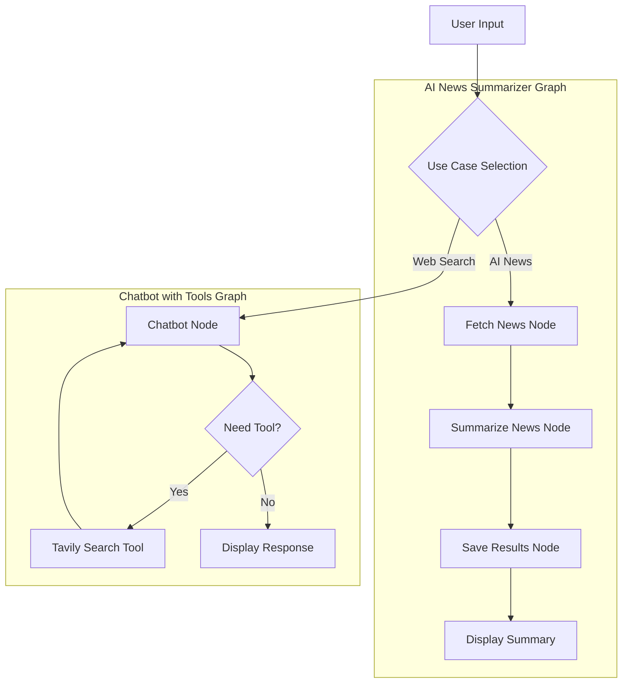

# AI News Summarizer & Multi-Agent Chatbot

A powerful, agentic AI application built with **Streamlit** and **LangGraph** that provides multiple AI-driven workflows, including a specialized AI News Digest, Agentic Search Chatbot, and a standard Basic Chatbot.

## 🚀 Features

### 1. AI News Summarizer
- **Daily/Weekly/Monthly Fetch**: Uses Tavily News API to fetch the latest advancements in AI.
- **Intelligent Summarization**: Automatically distills complex news into readable markdown summaries.
- **Instant Download**: Download your AI news digests as Markdown files directly from the UI.
- **Latest-First UI**: Optimized layout that keeps your most recent news fetch pinned at the top.

### 2. Agentic Chatbot with Web Search
- **Real-time Web Access**: Leverages the Tavily search engine to answer questions with up-to-date information.
- **Expandable Tool Logic**: Clean UI that hides complex tool execution details inside "🔧 View Tool Execution Details" expanders.
- **Streaming Responses**: Watch the AI think and respond in real-time.

### 3. Multi-Model Support
- **Groq**: Ultra-fast inference with Llama 3 models.
- **OpenAI**: Industry-standard GPT-4o and GPT-4o-mini.
- **Gemini**: Google's latest generative models.

### 4. Advanced UI/UX
- **Session Persistence**: API keys are cached in the server environment, so you don't have to re-enter them on every refresh.
- **Use-Case Isolation**: Chat history is managed separately for each workflow. Switching use cases "cleans" the UI to show only relevant history.
- **Interactive Graphs**: Visual representation of the LangGraph workflow being executed.

---

## 🏗️ Architecture

The project uses **LangGraph** to manage stateful, multi-step agentic workflows.



---

## 🛠️ Tech Stack

- **Frontend**: Streamlit
- **Orchestration**: LangGraph
- **LLM Framework**: LangChain
- **Search Engine**: Tavily API
- **Models**: Groq, OpenAI, Google Gemini
- **Environment**: Python 3.10+

---

## 📋 Prerequisites

- Python 3.10 or higher
- API Keys for one of the following:
  - [Groq AI](https://console.groq.com/)
  - [OpenAI](https://platform.openai.com/)
  - [Google AI Studio](https://aistudio.google.com/)
- [Tavily API Key](https://tavily.com/) (Required for News and Search features)

---

## ⚙️ Installation & Setup

1. **Clone the repository**:
   ```bash
   git clone <repository-url>
   cd AI_News_Summarizer
   ```

2. **Set up Virtual Environment**:
   ```bash
   python -m venv .venv
   source .venv/bin/activate  # Linux/Mac
   # or
   .venv\Scripts\activate     # Windows
   ```

3. **Install Dependencies**:
   ```bash
   pip install -r requirements.txt
   ```

4. **Environment Variables (Optional)**:
   Create a `.env` file in the root directory to auto-load your keys:
   ```env
   GROQ_API_KEY=your_key
   OPENAI_API_KEY=your_key
   GOOGLE_API_KEY=your_key
   TAVILY_API_KEY=your_key
   ```

---

## 🚀 Running the App

Start the Streamlit server:
```bash
streamlit run app.py
```

1. Select your **Model Provider** and **Use Case** in the sidebar.
2. Enter your **API Keys** if not set in `.env`.
3. For the **AI News Summarizer**, click "Fetch Latest AI News".
4. For Chatbot modes, simply type your question in the chat input at the bottom.

---

## 📁 Project Structure

- `src/main.py`: Main application logic and UI orchestration.
- `src/ui/`: UI components (Layout, Results Display, Config).
- `src/workflow/graphs/`: LangGraph definitions for different use cases.
- `src/workflow/nodes/`: Functional nodes for fetching, summarizing, and chatting.
- `src/workflow/llms/`: LLM integration wrappers.
- `data/`: Local storage for archived news results.

---

